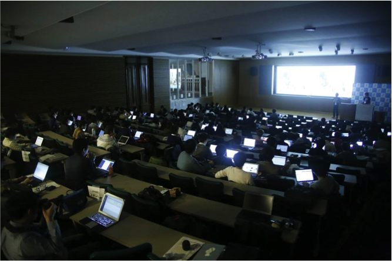

## JPHACKS2015 概要
### 開催概要
JPHACKSは,2014年（ハッカソン：12/13-14，アワード：12/20）に第１回を東京大学ソーシャルICTグローバル・クリエイティブリーダー育成プログラム（GCL)が中心となり，43校120名の学生が参加して開催し，国内最大規模の学生ハッカソンとして成功を収めました． 
2015年度は，北海道大学，東北大学，神戸市，熊本大学の協力を得て，開催場所を全国5地区に拡大し，300名を超える学生の参加者を募集して開催します． 
JPHACKSは，日本の学生のモノづくりの力を最大限に生かす場を提供し，日本の情報科学の発展に寄与することを目指します．

### 1. JPHACKS HACKATHON（ハッカソンの部）
|名称|JPHACKS HACKATHON|
|---|---|
|開催日程|2015年11月28日(土)・11月29日(日)|
|開催時間|28日(土)9:00〜20:00 29日(日)09:00〜19:00|
|開催場所|東京会場：[東京大学(本部)](http://www.u-tokyo.ac.jp/campusmap/map01_02_j.html) 北海道会場：[北海道大学](http://www.hokudai.ac.jp/) 東北会場：[東北大学](http://www.tohoku.ac.jp/japanese/) 関西会場：[ミント神戸](http://mint-kobe.jp/access/) 九州会場：[熊本大学](http://www.kumamoto-u.ac.jp/)|
|参加者数|東京会場：100名(30チーム)程度 各地方会場：50名(15チーム)程度|
|参加資格|・全国の大学生・大学院生・専門生・高専生の学生（学年不問） ・満18歳以上であること|
|参加費用|参加費無料　※各ハッカソン会場までの交通費及び宿泊費は自己負担|
|開催概要|JPHACKS HACKATHONは、全国300名を超える学生が全国5箇所の会場に集まり、同時に開催されるハッカソンです。|
|会場イメージ||

### 2. JPHACKS FINAL（ピッチ・ミートアップの部）
|名称|JPHACKS FINAL|
|---|---|
|開催日程|2015年12月12日（土）|
|開催時間|12:00〜20:00(予定)|
|開催場所|会場：[東京大学本郷キャンパス](http://www.u-tokyo.ac.jp/campusmap/map01_02_j.html)|
|参加人数|・FINAL進出チーム15チーム ・その他ハッカソン参加学生：100名〜150名程度(FINAL参加を希望する学生)|
|参加資格|・全国の大学生・大学院生・専門生・高専生の学生（学年不問） ・満18歳以上であること|
|参加費用|無料 ※FINAL採択チームは以下の遠方支援（交通費および宿泊費補助）を受けることが出来ます。|
|遠方支援|・交通費補助：上限2万円（一人あたり、往復） ・宿泊費補助：上限5000円（一人あたり） ※東京予選会場以外の参加者が対象|
|開催概要|JPHACKS FINALは、HACKATHONの成果物発表の場として、ピッチを行うイベントです。 また、スポンサー企業や協力団体との交流の場を設ける事により、開発した作品の製品化に向けたマッチングやパートナー探しの場として、新しい出会いを創出します。|

--------------
[[目次へ戻る](../README.md)] [[全体の流れへ](schedule.md)]

----
JPHACKS運営事務局
