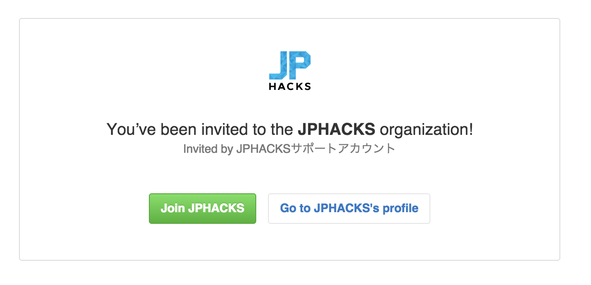
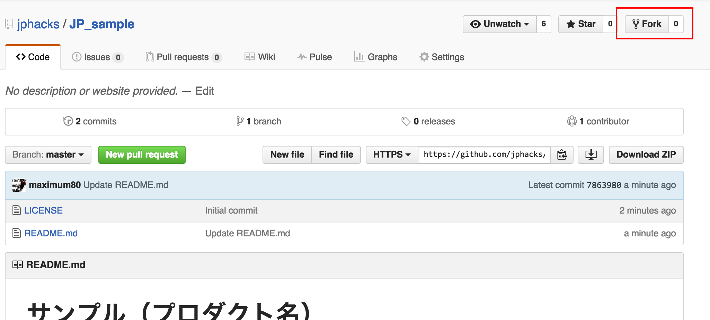
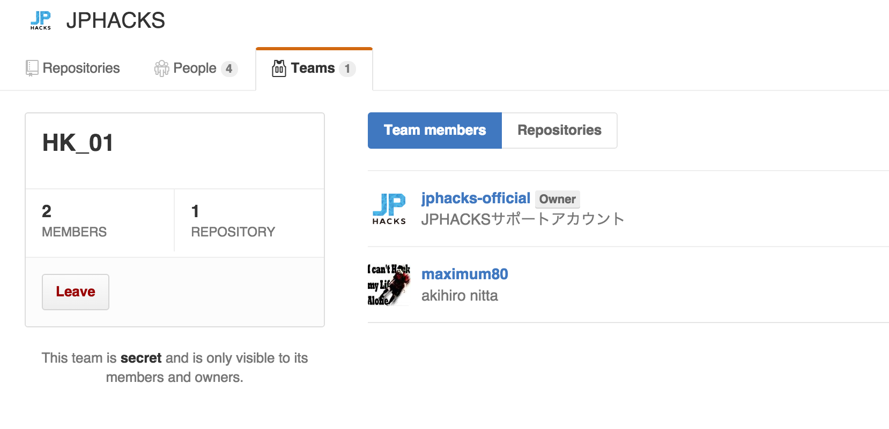
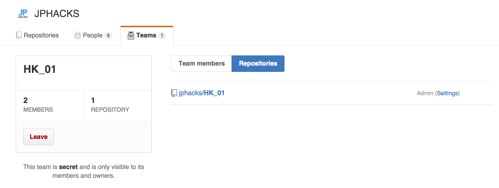
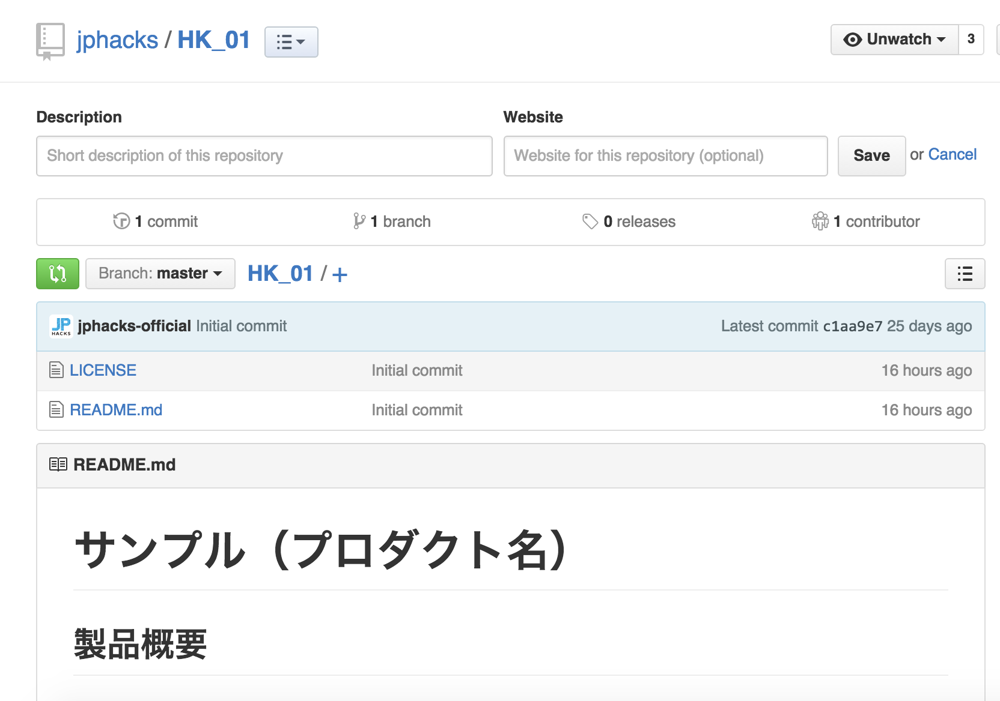
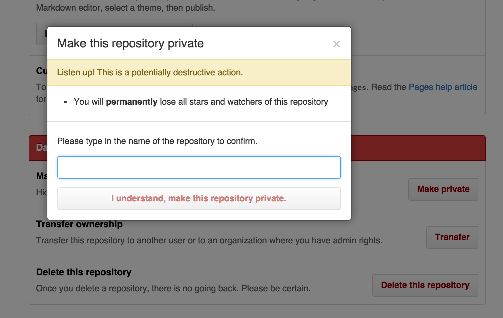

# 製品開発・提出方法
JPHACKSでは参加者の方々がより開発に時間を費やし、質の高い製品開発をサポートするために、GitHub、DEVPOSTという外部サービスを活用しております。

## 前提条件
GitHub、DEVPOSTの登録が完了、ログインしている状態であることを前提として、開発から提出方法を記載いたします。

## 開発から提出の流れ

1. [JPHACKSオフィシャルアカウントからのメンバー招待の確認と承認](#section1)
2. [チームリポジトリの確認](#section2)
3. [リポジトリの設定(公開か非公開かの設定)](#section3)
4. [開発製品の登録・README.mdの完成](#section4)
5. [DEVPOSTへの登録](#section5)
6. [フォームでの作品提出](#section6)

### <a name="section1">1.JPHACKSオフィシャルアカウントからのメンバー招待の確認と承認

#### 1-1. 招待メールの確認
申請したメールアドレスに、以下の招待メールが届いていることを確認し、本文中段のリンクをクリックし、招待の確認をします。
```
Hi akihiro nitta,

JPHACKSサポートアカウント has invited you to join the JPHACKS organization on GitHub. Head over to https://github.com/jphacks to check out JPHACKS's profile.

To join JPHACKS, follow this link:

https://github.com/orgs/jphacks/invitation?via_email=1

Some helpful tips:

- If you get a 404 page, make sure you’re signed in as maximum80.
- You can also accept the invitation by visiting the organization page directly at https://github.com/jphacks

If you were not expecting this invitation, you can ignore this email.

Thanks,
The GitHub Team
```

#### 1-2. チーム招待の承認

正体のURLにアクセスすると、上記のようなJPHACKS運営事務局からの招待を確認できます。  
"JOIN JPHACKS"のボタンをクリックして、チームの招待を承認してください。

### <a name="section2">2. チームリポジトリの確認

#### 2-1. チームIDの確認
承認して、JPHACKSの組織に所属したら、[チームページ](https://github.com/orgs/jphacks/teams)にアクセスしてください。
以下のように所属しているチームを閲覧することが出来ます。


```
会場ID_チームID
```
が記載された、チームが表示されています。
表示されているIDがみなさんの今回のチームIDになりますので、ご確認ください。

* 会場ID
 * 北海道：HK
 * 東北：TH
 * 東京：TK
 * 神戸：KB
 * 熊本：KM
* チームID：01~30まで

* 例)北海道会場の01番のチーム
```
HK_01
```

#### 2-2. チームリポジトリの確認

自身のチームを確認できたら、そのページからチームIDをクリックしてください。
以下のチームの詳細ページが表示されます。


表示されたら、**Repository**をクリックしてください。



表示されたリポジトリが今回皆様にご利用いただくリポジトリとなります。
以下のような画面が表示されれば問題ございません。



リポジトリ内に
* README.md
  * 提出に必要な項目の記載されたファイル
* LICENSE
  * ライセンスファイル

が既に保存されている事を確認してください。

### <a name="section2">3. リポジトリの設定(公開か非公開かの設定)

JPHACKSではGitHubを活用した開発と作品の提出を必須としております。
参加者は製品ライセンスの異なる以下の2つの開発手法を選択することが出来ます。
オープンソースの開発のメリットとしては、共同編集者による支援が獲得出来る可能性がある点、DEVPOSTへの提出が安易になる等がございますが、反面「製品情報を公開する」という点がございます。[開発ルール](rule.md)にも記載のある通り、JPHACKS運営事務局では、もし著作権や知的財産権その他の権利を侵害する行為があった場合においても、一切の責任は負いかねますので、製品情報を良くお確かめの上、公開非公開の選択をしていただきますようお願い致します。

#### 3-1. オープンソースプロジェクトとして開発する
オープンソースプロジェクトとして開発をする場合、ソースコードはOSSとして一般に公開されます。
またJPHACKSではMITライセンスの適用を推奨しております。既に指定のファイルの保存や設定はされているので、[コチラ](#section4)をクリックして次のステップに移動してください。

#### 3-2. プライベートリポジトリを活用して開発する
プロジェクトのソースコードを非公開にしたい場合は、GitHubのプライベートリポジトリを活用します。
リポジトリをプライベートにするためには、以下の方法に従ってください。  

* また、製品情報を公開したくない場合は、必ず製品情報をpushする前にリポジトリをプライベートににするようにお気をつけ下さい。
画面右側のSettingsをクリックして、設定ページに移動してください。



* ページ下部の**DangerZone**にある**Make Private**ボタンをクリックしてください。
* モーダルが立ち上がりますので、リポジトリ名を入力し、**I understand,make this repository private**を 選択してください。

設定が完了すると以下のように、リポジトリ名のとなりに、**"Private"**が表示されていれば、設定は完了です。


## 4. <a name="section4">開発製品の登録・README.mdの完成

* Gitリポジトリとして製品のバージョン管理を実施してください。
* リポジトリの設定（リポジトリページ > settings > Collaborators & teams > Collabrater）にて、開発メンバーを追加して開発することを推奨します。
* GitHub、Gitによる製品のバージョン管理がわからないチームは、ハッカソン前に外部サイトなどで使い方を習得するようお願いいたします。
  * 運営側でもGitHubの使い方については、Slackのチャンネル上でフォローアップを致します。
* README.mdの空欄を埋めて、内容を完成させてください。

* 完成形のイメージとして、[サンプル](https://github.com/jphacks/sample/tree/tum-music)をご参照ください。

## 5. <a name="section5">DEVPOSTへの登録
### 5-1. オープンソースプロジェクトの場合
* [プロジェクトの登録ページ](http://devpost.com/software/)にアクセスしてください。
* GitHubリポジトリのインポートを選択し、今回作成した製品のリポジトリを指定し、インポートをしてください。
* 登録の詳細ページに、入力事項を埋めて、登録を完了してください。
* **[必須]GitHubのURLは提出が必須となります。URLが記入されているかどうか、かならずお確かめ下さい。**
* **[必須]デモ動画など、作品のUI/UXがわかるものを登録してください。**

* 完成形のイメージとして、[サンプル](http://devpost.com/software/tum-music)をご参照ください。

### 5-2. プライベートリポジトリの場合
* [プロジェクトの登録ページ](http://devpost.com/software/)にアクセスしてください。
* 今回作成したプロジェクトの情報を登録してください。
* 今回作成したリポジトリのREADME.md([サンプル](https://github.com/jphacks/sample/blame/master/README.md))にアクセスし、コピーをしてください。
* "Here's the whole story"の部分には、かならずREADME.mdと同じ内容のフォーマットにて、製品情報を登録してください。
* 登録の詳細ページに、入力事項を埋めて、登録を完了してください。
* **[必須]GitHubのURLは提出が必須となります。URLが記入されているかどうか、かならずお確かめ下さい。**
* **[必須]デモ動画など、作品のUI/UXがわかるものを登録してください。**

* 完成形のイメージとして、[サンプル](http://devpost.com/software/tum-music)をご参照ください。

## 6. <a name="section6">フォームによる作品の提出
* [製品提出フォーム](https://docs.google.com/forms/d/1NmH8tDSldl1b_q5QyhVPEB-rnnedVGIHF-5upFwe7Dc/viewform)にアクセスし、必要事項を記入します。
* チーム決定時に配布されている、会場ID・チームIDを入力してください。
* [5.](section5)で登録をしたDEVPOSTのプロジェクトURLを記入してください。
  * DEVPOST以外のURLは受け付けておりませんので、ご注意ください。
* エントリ部門を第一希望から第三希望まで選択してください。

## 注意事項
* 一度製品情報を提出された場合、再びの提出はできませんのでご注意下さい。
* ハッカソン終了時刻までに、不慮の事態を除き提出が遅れた場合は、提出が認められない場合がございます。予めご了承下さい。

## 提出必須物の確認表
フォーム提出前に、DEVPOST上のプロジェクト内容に、以下の項目が全て当てはまっているか、かならずご確認ください。
- [ ] GitHubリポジトリのURLが記入されている
- [ ] 製品概要が、運営が提供するフォーマット[README.md](https://github.com/jphacks/sample/blame/master/README.md)と同様である
- [ ] DEMO動画が正しく再生することができている

--------------
[[目次へ戻る](../README.md)] [[審査基準へ](criteria.md)]

----
JPHACKS運営事務局
